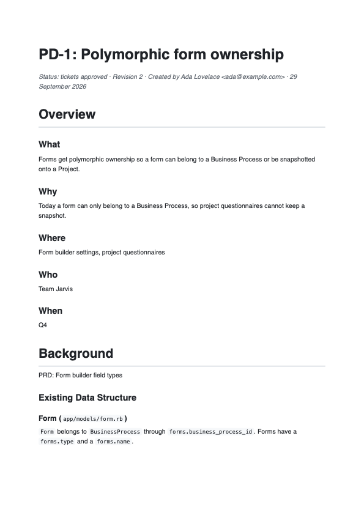
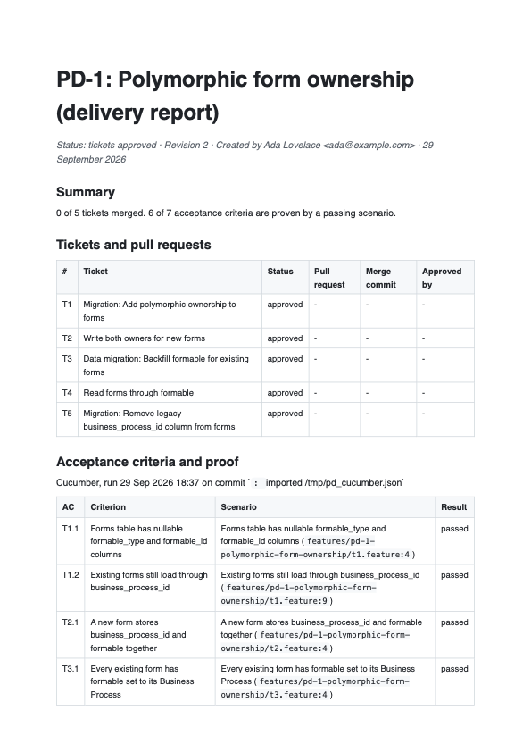

# plan_driven

[](https://github.com/blaz1988/plan-driven/actions/workflows/main.yml)
[](LICENSE.txt)
[](#rails-and-ruby-support)
[](#rails-and-ruby-support)

**From implementation plan to merged, tested pull requests, driven from the terminal.**

`plan_driven` runs a Rails team's delivery process from the command line. A short interview in
the terminal becomes an implementation plan grounded in your real schema. Guards written in
Ruby check the plan, it's rendered to PDF, and it's approved. The approved plan becomes
tickets, each ticket goes to a Cursor cloud agent that opens a pull request, and only the pull
requests you approve are merged. Acceptance criteria map to Cucumber scenarios, so the delivery
report shows which criterion is proven by which passing test.

Every phase leaves documentation behind in `docs/plans/`: the plan, the tickets, who approved
what, and the delivery report.

Built and maintained by [Rubycode](https://rubycode.co), a Ruby on Rails consultancy from
Zagreb. [Need Rails engineers?](#about-rubycode)

## Contents

- [How it works](#how-it-works)
- [Installation](#installation)
- [A plan from start to finish](#a-plan-from-start-to-finish)
- [Guards](#guards)
- [What the agent is told](#what-the-agent-is-told)
- [Evidence and the delivery report](#evidence-and-the-delivery-report)
- [Commands](#commands)
- [Configuration](#configuration)
- [Keys](#keys)
- [Rails and Ruby support](#rails-and-ruby-support)
- [Development](#development)
- [Contributing](#contributing)
- [About Rubycode](#about-rubycode)
- [License](#license)

## How it works

```
 plan-driven new          interview in the terminal, the model drafts the rest
        │                 PlanGuard + MigrationGuard, repaired until they pass
        ▼
 plan-driven submit       draft ─▶ in review          docs/plans/pd-1-…/plan.pdf
 plan-driven approve      in review ─▶ approved       every configured role signs off
        │
        ▼
 plan-driven tickets      approved ─▶ ticketed        TicketNormalizer + TicketGuard
 plan-driven approve-tickets  ─▶ tickets approved     GitHub issues created
        │
        ▼
 plan-driven develop      one Cursor cloud agent per ready ticket, one PR each
 plan-driven status       agent finished ─▶ PR open
 plan-driven review       PrGuard: scope, specs, Cucumber scenarios, CI
 plan-driven approve-pr   PR approved
 plan-driven merge        merged; dependent tickets become ready
        │
        ▼
 plan-driven evidence     Cucumber results mapped to acceptance criteria
 plan-driven report       docs/plans/pd-1-…/delivery-report.pdf
```

Phases are stored in your application's database, so a plan can't skip a step. Tickets can't
be drafted before the plan is approved, agents can't start before the tickets are approved,
and a ticket starts only once every ticket it depends on is merged. Editing an approved plan
creates a new revision and asks for approval again.

The model does the writing and Ruby does the checking. Rules that have one right answer, like
title prefixes, estimates on the team's scale and the order of expand and contract, are
enforced or corrected in code rather than asked for in a prompt. Guard errors go back to the
model as a list to fix, and a plan that still fails isn't accepted.

## Installation

Add the gem to your application's Gemfile:

```ruby
gem "plan_driven", group: :development
```

Install it, generate the tables and the initializer, and add your keys:

```bash
bundle install
bin/rails generate plan_driven:install
bin/rails db:migrate
bundle exec plan-driven configure
bundle exec plan-driven doctor
```

The generator adds five tables (`plan_driven_plans`, `_tickets`, `_approvals`, `_events` and
`_evidence_runs`), `config/initializers/plan_driven.rb` and `docs/plans/`. Nothing else in
your application changes.

For PDFs, install Google Chrome or Chromium. Without one, plans are written as Markdown and
HTML only.

## A plan from start to finish

### 1. The interview

```
$ bundle exec plan-driven new "Polymorphic form ownership"

Plan: Polymorphic form ownership
A few questions first. The rest of the plan is drafted from your answers and the schema.
What: What are we building? Describe the change as the user will see it.
  > Forms get polymorphic ownership so a form can belong to a Business Process or be
  > snapshotted onto a Project.
  >
Why: Why now? What problem or gap does it close?
  ...
Drafting with openai/gpt-4.1...
✓ PD-1 drafted (1 attempt)
  assumed: Business Process stays the default owner
✓ All checks passed
  docs/plans/pd-1-polymorphic-form-ownership/plan.md
  docs/plans/pd-1-polymorphic-form-ownership/plan.html
  docs/plans/pd-1-polymorphic-form-ownership/plan.pdf
```

You answer the questions only people can answer: what, why, where, who, when, background and
what's out of scope. The model drafts everything else from your answers and your schema:
the existing data structure, architecture, database, application and infrastructure changes,
risks, performance, security with a risk level, monitoring, outstanding questions and testing.
The sections follow the implementation plan template teams commonly keep in Confluence.



### 2. Review and approval

```bash
bundle exec plan-driven show PD-1                         # or open the PDF
bundle exec plan-driven edit PD-1 database_changes        # in $EDITOR
bundle exec plan-driven redraft PD-1 monitoring "add alerting on the backfill"
bundle exec plan-driven submit PD-1
bundle exec plan-driven approve PD-1 --as review --note "Rollout is clear"
```

Approval roles come from `config.plan_approvals`, for example
`%w[review qa devops director]`. The plan is approved when every role has signed off on the
current revision.

### 3. Tickets

```
$ bundle exec plan-driven tickets PD-1
  fixed: T1: title prefixed with "Migration:"
  fixed: T3: title prefixed with "Data migration:"
✓ Tickets pass every check
#   Title                                             Kind        Pts  Status
T1  Migration: Add polymorphic ownership to forms     migration   2    draft
T2  Write both owners for new forms                   dual_write  3    draft
T3  Data migration: Backfill formable for existin...  backfill    2    draft
T4  Read forms through formable                       switch      3    draft
T5  Migration: Remove legacy business_process_id ...  migration   1    draft

$ bundle exec plan-driven approve-tickets PD-1
✓ 5 tickets approved
  T1 -> issue #41
  ...
```

Every ticket has a type, a kind, a description, testable acceptance criteria, an estimate,
its dependencies and the tables it touches. They're added to the plan's PDF as a work
overview table. Approving them creates a GitHub issue for each, unless `sync_issues` is off.

### 4. Development

```
$ bundle exec plan-driven develop PD-1
  T1 Migration: Add polymorphic ownership to forms
Start 1 Cursor cloud agent(s)? [y/N] y
✓ T1 agent started: https://cursor.com/agents/bc-…

$ bundle exec plan-driven status PD-1
$ bundle exec plan-driven review PD-1/T1
$ bundle exec plan-driven feedback PD-1/T1 "Use batches of 500"
$ bundle exec plan-driven approve-pr PD-1/T1
$ bundle exec plan-driven merge PD-1/T1
This merges into main. Type T1 to continue: T1
✓ PD-1/T1 merged (4f1c2ab)
Now ready: T2, T3. `plan-driven develop PD-1`
```

Only tickets whose dependencies are merged are started, up to `max_parallel_agents` at a time,
so each agent begins from a branch that already has the work it builds on. Feedback goes to the
same agent as a follow-up, and the agent pushes to the same pull request. Merging asks you to
type the ticket key, and nothing is merged while a guard fails or CI is still running. Pull
requests merged directly on GitHub are picked up by `status`.

## Guards

Guards are plain Ruby classes that return errors, warnings and fixes. An error blocks the next
step and a warning is shown and recorded.

**PlanGuard** runs on every draft and before `submit`:

- every required section is written, and long enough to be useful;
- Existing Data Structure describes only what exists: every model, `app/models` path and
  `table.column` it mentions is checked against the application;
- Security ends with a risk level (LOW, MEDIUM or HIGH);
- placeholders such as TBD and TODO are flagged.

**MigrationGuard** reads the database changes:

- removing or renaming a column or table in one step is an error, unless the plan stages it
  with `ignored_columns`, expand and contract, or a later release;
- NOT NULL on an existing table without a default or backfill is a warning;
- on PostgreSQL, an index that isn't built concurrently is a warning.

**TicketNormalizer** fixes, and reports, anything with one right answer: keys in order,
dependencies renumbered, kinds and types normalized, "Migration:" and "Data migration:"
title prefixes, estimates rounded up to the team's scale, and lists cleaned up.

**TicketGuard** checks the breakdown:

- each ticket has a title, a description and at least one acceptance criterion long enough to
  test, and a story says "so that";
- estimates are within `max_estimate`, so a ticket too big for one pull request is split;
- dependencies exist and have no cycles;
- on each table, expand and contract happens in order: migration, dual write, backfill,
  switch, then cleanup. A migration that removes a column counts as cleanup;
- a table the plan changes that no ticket touches is flagged.

**PrGuard** runs on `review`, before `approve-pr` and again before `merge`:

- the pull request stays within `max_pr_changed_lines`;
- it contains specs or features;
- only migration and backfill tickets add migrations, and a new migration comes with a
  `db/schema.rb` change;
- every acceptance criterion has a Cucumber scenario tagged with the ticket and the criterion,
  for example `@pd-1-t3 @ac-2`;
- CI checks passed, with failures an error and pending checks a warning;
- the pull request names the ticket and closes its issue.

## What the agent is told

`plan-driven prompt PD-1/T3` prints the exact prompt. It contains the ticket, the parts of the
approved plan it needs, and the rules the pull request will be checked against afterwards:

```
# Ticket PD-1/T3: Data migration: Backfill formable for existing forms
Kind: backfill. Type: TASK.
...
# Definition of done
- Specs cover the change (spec/, test/, features/), and the existing suite still passes.
- Every acceptance criterion has a Cucumber scenario in
  `features/pd-1-polymorphic-form-ownership/t3.feature`. Tag the feature `@pd-1-t3` and each
  scenario `@ac-N`, where N is the criterion's number above.
- Keep the change within 800 changed lines.

# Rules
- Schema changes only in migration tickets; this ticket is a backfill ticket.
- Migrations are additive and reversible. Never remove or rename a column that code still reads.
- Don't edit files under docs/plans; they are the approved plan.
- Service objects live in app/services and respond to .call.      ← config.team_rules

# Pull request
Title it exactly: [PD-1/T3] Data migration: Backfill formable for existing forms
```

## Evidence and the delivery report

```
$ bundle exec plan-driven evidence PD-1
Running cucumber --tags "@pd-1-t1 or @pd-1-t2 or @pd-1-t3 or @pd-1-t4 or @pd-1-t5"
AC    Result  Criterion
T1.1  passed  Forms table has nullable formable_type and formable_id columns
T1.2  passed  Existing forms still load through business_process_id
T3.2  passed  Running the backfill twice changes nothing the second time
...
✓ 7 of 7 acceptance criteria are proven by a passing scenario.

$ bundle exec plan-driven report PD-1
```

`evidence` runs the plan's scenarios and stores the result with the commit it ran on.
`--from cucumber.json` imports a run from CI instead. The delivery report lists each ticket
with its pull request, merge commit and approver, then the acceptance criteria with the
scenario that proves each one, the guard findings, every approval and the full timeline.



## Commands

| Command | What it does |
| --- | --- |
| `new TITLE` | Interview, then draft the plan from the answers and the schema |
| `list` | Every plan and its phase |
| `show PLAN [--section KEY]` | Print the plan or one section |
| `edit PLAN SECTION` | Edit a section in `$EDITOR` |
| `redraft PLAN SECTION "instruction"` | Have the model rewrite one section |
| `check PLAN` | Run the plan guards |
| `submit PLAN` | Send the plan for approval; the guards must pass |
| `approve PLAN [--as ROLE] [--note TEXT]` | Approve the current revision |
| `reject PLAN --note TEXT` | Send the plan back to draft |
| `pdf PLAN` | Write the plan as Markdown, HTML and PDF |
| `tickets PLAN` | Draft tickets from the approved plan |
| `approve-tickets PLAN` | Approve the tickets and create GitHub issues |
| `prompt PLAN/TICKET` | Show what the agent will be told |
| `develop PLAN [TICKET...]` | Start agents for ready tickets |
| `status PLAN` | Poll agents and pull requests |
| `review PLAN/TICKET` | Run the pull request guards |
| `approve-pr PLAN/TICKET` | Approve the pull request; the guards must pass |
| `feedback PLAN/TICKET "text"` | Send review feedback to the ticket's agent |
| `merge PLAN/TICKET` | Merge an approved pull request, after typing the ticket key |
| `evidence PLAN [--from FILE]` | Run or import Cucumber results |
| `report PLAN` | Write the delivery report |
| `log PLAN` | The audit trail |
| `configure` | Store keys in `~/.plan_driven/config` |
| `doctor` | Check keys, repository, PDF browser and the Cursor connection |

Who did something is taken from `PLAN_DRIVEN_ACTOR`, or from `git config user.name` and
`user.email`. `--yes` skips confirmations, for scripts.

## Configuration

Everything has a default. The generated initializer lists the settings:

```ruby
# config/initializers/plan_driven.rb
PlanDriven.configure do |config|
  config.llm_provider = :openai                 # or :anthropic, or :cursor
  config.llm_model = "gpt-4.1"                  # default: gpt-4.1, claude-sonnet-4-5, claude-opus-5-5
  config.llm_api_base = nil                     # an OpenAI-compatible gateway
  config.node_command = "node"                  # :cursor only; Node 22.13+ (or PLAN_DRIVEN_NODE)

  config.plan_approvals = %w[review qa devops director]
  config.ticket_approvals = %w[review]

  config.agent_model = nil                      # the Cursor agent's model; nil uses your default
  config.base_branch = "main"
  config.max_parallel_agents = 3

  config.github_repository = nil                # read from the origin remote when nil
  config.sync_issues = true
  config.merge_method = "squash"

  config.estimate_scale = [1, 2, 3, 5, 8]
  config.max_estimate = 5
  config.max_pr_changed_lines = 800
  config.require_specs_in_pr = true
  config.cucumber = true

  config.team_rules = ["Authorization goes through Pundit policies, never in controllers."]
  config.extra_context = "Tenancy is by Account; every table has account_id."
  config.docs_path = "docs/plans"
end
```

Planning is where a stronger model pays for itself, so the defaults are GPT-4.1 and Claude
Sonnet rather than their mini versions. A plan costs a few cents.

`llm_provider :cursor` drafts with any model on your Cursor account (Claude Opus by default)
through the [Cursor SDK](https://cursor.com/docs/sdk/typescript), with no other LLM key. The
agent runs on your machine with read-only tools (read, grep, glob, ls), so it reads the
application's code while it writes the plan and can't change a file. It needs Node 22.13+ and
the SDK: `npm install --prefix ~/.plan_driven/node @cursor/sdk`. `plan-driven doctor` checks both.

`config.template` replaces
the plan's sections if your template differs, and `config.pdf_renderer` takes any callable
`(html_path, pdf_path)` if you'd rather not use Chrome.

## Keys

| Key | Used for | Environment |
| --- | --- | --- |
| `openai_api_key` or `anthropic_api_key` | drafting plans and tickets | `OPENAI_API_KEY`, `ANTHROPIC_API_KEY` |
| `cursor_api_key` | cloud agents, and drafting with `llm_provider :cursor` (Cursor dashboard, Integrations) | `CURSOR_API_KEY` |
| `github_token` | issues, pull requests, checks, merge | `GITHUB_TOKEN`, or `gh auth token` |

Keys are read from the environment first, then from `~/.plan_driven/config` (mode 0600 in a
0700 directory), which `plan-driven configure` writes. A key from the environment is never
copied to disk, and no key is ever written into your application or its configuration.

## Rails and Ruby support

Ruby 3.1 or newer and Rails 7.0 or newer. CI runs the suite on every supported combination:

| | Rails 7.0 | Rails 7.1 | Rails 7.2 | Rails 8.0 | Rails 8.1 |
| --- | :---: | :---: | :---: | :---: | :---: |
| Ruby 3.1 | ✓ | ✓ | ✓ | | |
| Ruby 3.2 | ✓ | ✓ | ✓ | ✓ | ✓ |
| Ruby 3.3 | ✓ | ✓ | ✓ | ✓ | ✓ |
| Ruby 3.4 | | | ✓ | ✓ | ✓ |

The OpenAI, Anthropic, Cursor and GitHub APIs are called over `net/http`, so the gem depends
on nothing beyond Rails.

## Development

```bash
bin/setup
bundle exec rake        # specs and RuboCop
bin/matrix              # the specs on every supported Ruby and Rails combination
```

The specs run against an in-memory SQLite schema, with a fake LLM and a fake HTTP transport,
so nothing reaches the network. One spec takes a plan from the interview to delivered through
every guard, agent run, review and merge.

## Contributing

Contributions are very welcome: bug reports, a guard your team relies on, a plan the drafter
got wrong, or clearer docs. You don't need permission to start.

**Found a problem?** [Open an issue](https://github.com/blaz1988/plan-driven/issues/new) with
your Ruby, Rails and gem versions, the command you ran and what happened. Leave out keys and
anything confidential from your plans.

**Want to send a fix?** Contributions go through a fork and a pull request:

1. [Fork the repository](https://github.com/blaz1988/plan-driven/fork) and clone your fork.
2. Create a branch for your change: `git checkout -b guard-for-enum-changes`.
3. Run `bin/setup`, make the change, and add a spec for it.
4. Run `bundle exec rake` and make sure specs and RuboCop pass.
5. Add a line to the `Unreleased` section of [CHANGELOG.md](CHANGELOG.md).
6. Push the branch to your fork and
   [open a pull request](https://github.com/blaz1988/plan-driven/compare) against `main`.

For a larger change, such as a new agent backend or a new phase, open an issue first so we can
agree on the approach. See [CONTRIBUTING.md](CONTRIBUTING.md) for the details, and report
security issues privately as described in [SECURITY.md](SECURITY.md).

## About Rubycode

`plan_driven` is written and maintained by [Rubycode](https://rubycode.co). We build and rescue
Ruby on Rails products: new applications, upgrades, performance work, and senior Ruby and Rails
engineers who join your team.

**Need Ruby or Ruby on Rails engineers? Get in touch.**

**Ivan Blažević**, creator of the gem

- Email: [ivan.blazevic@rubycode.co](mailto:ivan.blazevic@rubycode.co)
- Phone: [+385 99 351 3642](tel:+385993513642)
- LinkedIn: [linkedin.com/in/blazevic-ivan](https://www.linkedin.com/in/blazevic-ivan/)
- Web: [rubycode.co](https://rubycode.co)

## License

Released under the [MIT License](LICENSE.txt). Copyright © 2026 Ivan Blažević,
[Rubycode](https://rubycode.co).
