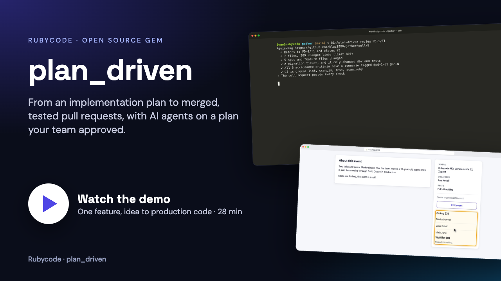
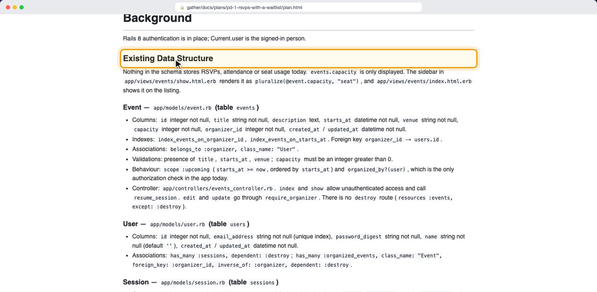
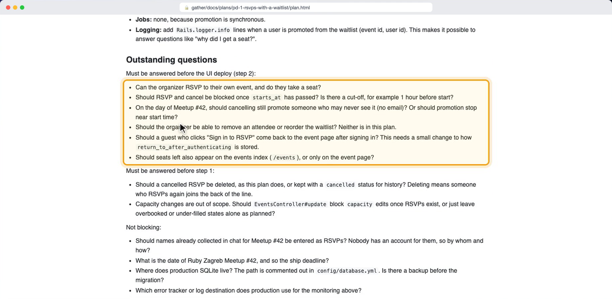
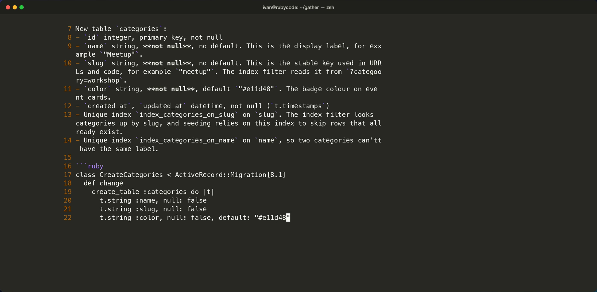
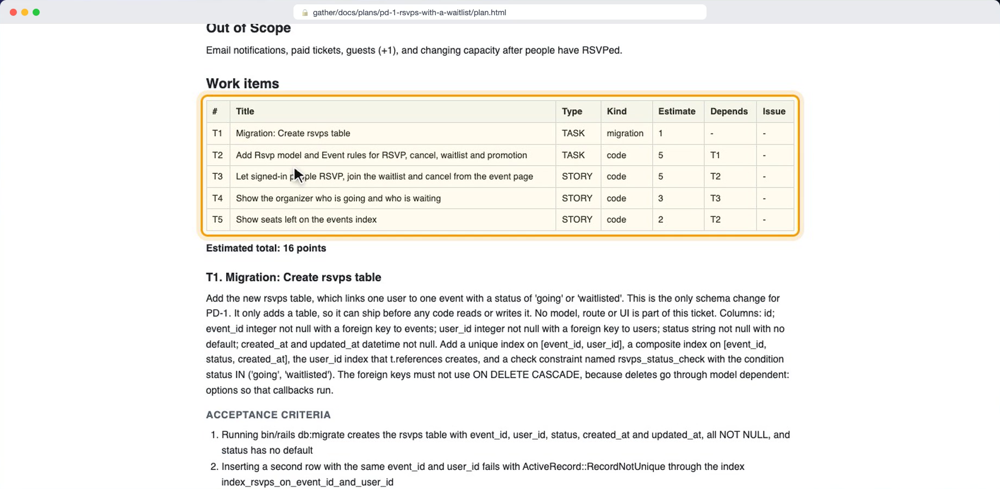
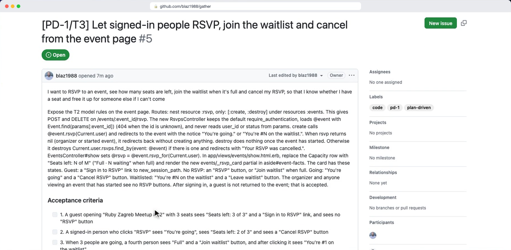
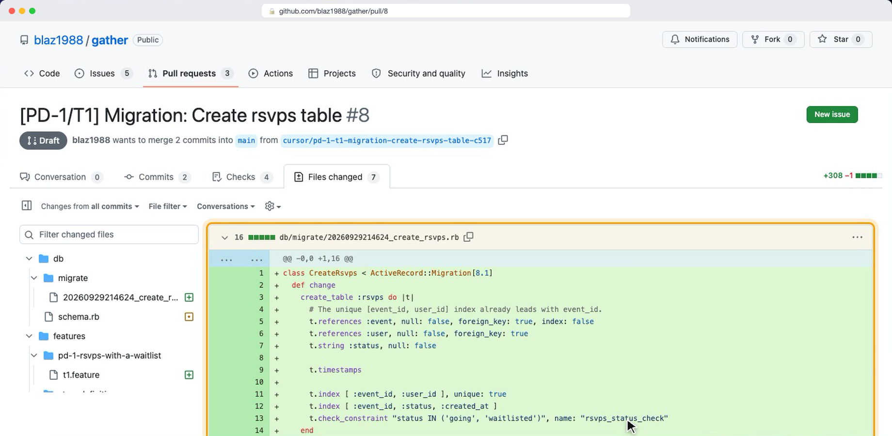
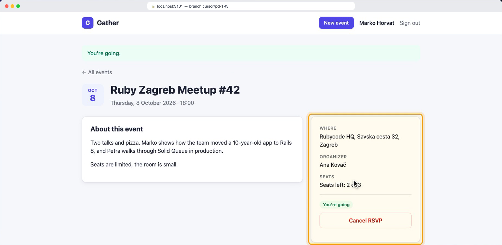
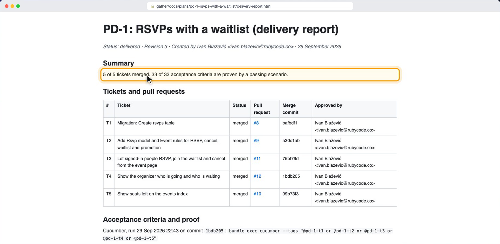
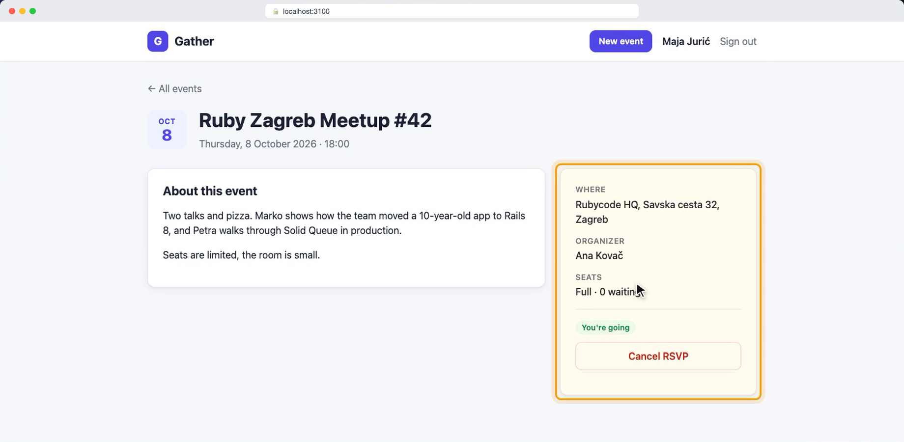

# plan_driven

[](https://github.com/blaz1988/plan-driven/actions/workflows/main.yml)
[](https://rubygems.org/gems/plan_driven)
[](LICENSE.txt)
[](#rails-and-ruby-support)
[](#rails-and-ruby-support)

**From implementation plan to merged, tested pull requests, driven from the terminal.**

`plan_driven` runs a Rails team's delivery process from the command line, with AI agents doing
the writing and your team making the decisions. A short interview in the terminal becomes an
implementation plan grounded in your real schema and code. Guards written in Ruby check the
plan, you read it and approve it. The approved plan becomes tickets, each ticket goes to a
Cursor cloud agent that opens a pull request, and only the pull requests you approve are
merged. Acceptance criteria map to Cucumber scenarios, so the delivery report shows which
criterion is proven by which passing test.

Every phase leaves documentation behind in `docs/plans/`: the plan, the tickets, who approved
what, and the delivery report.

Built and maintained by [Rubycode](https://rubycode.co), a Ruby on Rails company from
Zagreb. [Need Rails engineers?](#about-rubycode)

## Watch it deliver a feature

[](https://github.com/blaz1988/plan-driven/releases/download/v0.1.0/plan-driven-demo.mp4)

**[▶ Watch the demo](https://github.com/blaz1988/plan-driven/releases/download/v0.1.0/plan-driven-demo.mp4)**
(28 minutes, narrated, with captions). One feature, RSVPs with a waitlist, goes from an
idea to production code in a new Rails 8 app,
[Gather](https://github.com/blaz1988/gather). Nothing in it is staged: the plan, the five
tickets, the five pull requests ([#8](https://github.com/blaz1988/gather/pull/8) to
[#12](https://github.com/blaz1988/gather/pull/12)) and the delivery report are all in that
repository. The planner and the five agents ran on Claude Opus 5.5 through Cursor.

<details>
<summary>Chapters</summary>

| Time | Chapter |
| ---: | --- |
| 0:00 | Why plan_driven, the flow, and the guards |
| 2:10 | The app before the feature |
| 2:49 | `doctor`: keys, repository and the Cursor connection |
| 3:15 | The interview |
| 4:14 | Reading the implementation plan |
| 6:05 | Deciding the open questions with `redraft` |
| 6:50 | Every section can be changed: Database changes redrafted and edited in vim (PD-2) |
| 9:51 | Submitting and approving the plan |
| 10:23 | Tickets: drafted, steered to five, read and approved |
| 12:44 | The tickets as GitHub issues |
| 13:15 | What the agent is told, and starting the first agent |
| 14:10 | Reading the first pull request, `review`, `approve-pr` and `merge` |
| 16:21 | The model and its rules (T2) |
| 18:25 | The RSVP card, tried on the branch before merging (T3) |
| 20:44 | Feedback: a behind-main warning and a refactor (T5) |
| 23:15 | The organizer's attendee list (T4) |
| 24:50 | Evidence: 33 of 33 acceptance criteria, and the delivery report |
| 26:04 | The finished feature in the app |
| 27:15 | Recap |

</details>

## Contents

- [How it works](#how-it-works)
- [Requirements](#requirements)
- [Installation](#installation)
- [Getting your app ready](#getting-your-app-ready)
- [The browser wizard](#the-browser-wizard)
- [Walkthrough: one feature from idea to merged](#walkthrough-one-feature-from-idea-to-merged)
- [Guards](#guards)
- [What the agent is told](#what-the-agent-is-told)
- [Commands](#commands)
- [Configuration](#configuration)
- [Choosing the coding agents](#choosing-the-coding-agents)
- [Tokens and cost](#tokens-and-cost)
- [How it compares](#how-it-compares)
- [Keys](#keys)
- [Working as a team](#working-as-a-team)
- [Troubleshooting](#troubleshooting)
- [Rails and Ruby support](#rails-and-ruby-support)
- [Development](#development)
- [Contributing](#contributing)
- [About Rubycode](#about-rubycode)
- [License](#license)

## How it works

```
 plan-driven new          interview in the terminal, the model drafts the rest
        │                 PlanGuard + MigrationGuard, repaired until they pass
        ▼
 plan-driven submit       draft ─▶ in review          docs/plans/pd-1-…/plan.pdf
 plan-driven approve      in review ─▶ approved       every configured role signs off
        │
        ▼
 plan-driven tickets      approved ─▶ ticketed        TicketNormalizer + TicketGuard
 plan-driven approve-tickets  ─▶ tickets approved     GitHub issues created
        │
        ▼
 plan-driven develop      one agent per ready ticket (Cursor cloud, or a local CLI), one PR each
 plan-driven status       agent finished ─▶ PR open
 plan-driven review       PrGuard: scope, specs, Cucumber scenarios, CI, up to date
 plan-driven feedback     the same agent pushes a fix to the same PR
 plan-driven approve-pr   PR approved
 plan-driven merge        merged; dependent tickets become ready
        │
        ▼
 plan-driven evidence     Cucumber results mapped to acceptance criteria
 plan-driven report       docs/plans/pd-1-…/delivery-report.pdf, with tokens and cost
```

Phases are stored in your application's database, so a plan can't skip a step. Tickets can't
be drafted before the plan is approved, agents can't start before the tickets are approved,
and a ticket starts only once every ticket it depends on is merged. Editing an approved plan
creates a new revision and asks for approval again.

The model does the writing and Ruby does the checking. Rules that have one right answer, like
title prefixes, estimates on the team's scale and the order of expand and contract, are
enforced or corrected in code rather than asked for in a prompt. Guard errors go back to the
model as a list to fix, and a plan that still fails isn't accepted.

## Requirements

- Ruby 3.1+ and Rails 7.0+ (see [support](#rails-and-ruby-support)).
- The application on GitHub, with CI running on pull requests.
- Coding agents, one of (see [Choosing the coding agents](#choosing-the-coding-agents)):
  - **Cursor cloud agents** (the default): a [Cursor](https://cursor.com) account with the
    GitHub integration connected to that repository, and a Cursor API key (Cursor dashboard,
    Integrations).
  - **A local agent CLI** (`agent_provider :local`): Claude Code, Codex, the Cursor CLI or any
    command that edits files in its working directory, plus `git` push access to the repository.
- A model for drafting plans and tickets, one of:
  - **Cursor** (`llm_provider :cursor`): any model on your Cursor account, Claude Opus 5.5 by
    default. Needs Node 22.13+ and the Cursor SDK. No other LLM key.
  - **OpenAI** (`:openai`, GPT-4.1 by default) or any OpenAI-compatible gateway.
  - **Anthropic** (`:anthropic`, Claude Sonnet 4.5 by default).
- A GitHub token that can read and write issues and pull requests (see [Keys](#keys)).
- Optional: Google Chrome or Chromium for PDFs, and Cucumber for the evidence step.

## Installation

### 1. Add the gem

```ruby
# Gemfile
gem "plan_driven", group: :development
```

```bash
bundle install
bundle binstubs plan_driven          # bin/plan-driven, so you don't type bundle exec
```

### 2. Generate the tables and the initializer

```bash
bin/rails generate plan_driven:install
bin/rails db:migrate
```

The generator adds five tables (`plan_driven_plans`, `_tickets`, `_approvals`, `_events` and
`_evidence_runs`), `config/initializers/plan_driven.rb` and `docs/plans/`. Nothing else in
your application changes. The tables live in your development database, next to your app,
so the plan's phase and its audit trail travel with the code you're working on.

### 3. Choose the model that drafts

Planning is where a stronger model pays for itself. The demo drafts with Claude Opus 5.5 on a
Cursor account, which reads the application's code (read-only) while it writes:

```ruby
# config/initializers/plan_driven.rb
PlanDriven.configure do |config|
  config.llm_provider = :cursor
  config.llm_model = "claude-opus-5-5"
  config.request_timeout = 600          # a full plan from a large model can take a few minutes

  config.agent_model = "claude-opus-5-5" # the model the cloud agents use
end
```

`:cursor` needs Node 22.13+ and the Cursor SDK, installed outside your app:

```bash
npm install --prefix ~/.plan_driven/node @cursor/sdk
```

If `node` on your `PATH` is older, point the gem at a newer one with
`config.node_command = "/path/to/node"` or `PLAN_DRIVEN_NODE`.

With OpenAI or Anthropic instead:

```ruby
config.llm_provider = :openai            # gpt-4.1 by default
config.llm_provider = :anthropic         # claude-sonnet-4-5 by default
config.llm_api_base = "https://gateway.example.com/v1"   # optional, OpenAI-compatible
```

### 4. Add your keys

```bash
bin/plan-driven configure
```

It asks for each key, stores it in `~/.plan_driven/config` (mode 0600) and never echoes it. Keys
already in the environment are used as they are and never copied to disk. Nothing is written
into your application. See [Keys](#keys).

### 5. Check everything

```
$ bin/plan-driven doctor

plan-driven 0.1.0
✓ Rails application: plan_driven tables present
LLM: cursor/claude-opus-5-5
✓ Cursor SDK: Node v24.21.0, @cursor/sdk found
✓ cursor_api_key: /Users/ivan/.plan_driven/config
✓ github_token: /Users/ivan/.plan_driven/config
✓ GitHub repository: blaz1988/gather
✓ PDF: Google Chrome
✓ Cursor API: ivan@example.com
✓ Agent model: claude-opus-5-5
```

`doctor` checks the tables, the drafting model, Node and the SDK, each key, the GitHub
repository (from `config.github_repository` or the `origin` remote), the PDF browser, the Cursor
API and that your key can start agents with `agent_model`.

## Getting your app ready

The agents and the review guards rely on a few things in your repository. Set them up once.

**CI on pull requests.** `review` and `merge` read the checks on the pull request, and nothing
is merged while a check fails or is still running. Run your linters and your whole suite,
including Cucumber:

```yaml
# .github/workflows/ci.yml (the test job)
- name: Prepare the database
  run: bin/rails db:create db:schema:load
- name: RSpec
  run: bundle exec rspec
- name: Cucumber
  run: bundle exec cucumber --publish-quiet
```

**Cucumber.** Every acceptance criterion needs a scenario tagged with its ticket and number,
which is how `evidence` proves it. Add `cucumber-rails` to the test group and run
`bin/rails generate cucumber:install`, or let the first agent do it: the prompt tells it to if
the app has no Cucumber setup. Shared steps, such as signing in, keep the agents' features
short; point them out in `team_rules`.

**Your conventions.** `team_rules` and `extra_context` go into every agent prompt, and the
drafting model reads them too. Write them the way you'd brief a new engineer:

```ruby
config.team_rules = [
  "Views are ERB and reuse the classes in app/assets/stylesheets/application.css.",
  "Authentication is Rails 8's: Current.user, `allow_unauthenticated_access`, `authenticated?` in views.",
  "Keep controllers thin; put a multi-step change in a model method or a PORO in app/models.",
  "Tests are RSpec request and model specs with FactoryBot, and Cucumber features that reuse " \
  "features/step_definitions/common_steps.rb (e.g. `Given I am signed in as \"Ana Kovač\"`).",
  "bin/rubocop, bundle exec rspec and bundle exec cucumber must pass; CI runs all three."
]
config.extra_context = "Gather lists community events. An event has an organizer (a User) and a " \
                       "capacity in seats. Anyone can browse; signing in is needed to act."
```

**Who approves.** `plan_approvals` and `ticket_approvals` list the roles that must sign off,
for example `%w[review qa devops director]`. One person can hold every role on a small team.

## The browser wizard

Not everyone wants to drive a delivery from the terminal. The install generator mounts a
wizard in your app, in development only:

```ruby
# config/routes.rb
mount PlanDriven::Wizard::Engine, at: "/plan_driven" if Rails.env.development?
```

Start the app and open `http://localhost:3000/plan_driven`. It walks a plan through the same
five steps, with Back and Next: **Plan** (the interview, then read, edit or redraft any section
and submit), **Approve**, **Tickets**, **Agents & PRs** and **Proof & report**. A step opens
once the plan has reached it.

The wizard is a front end for the CLI, not a second implementation. Every button runs one
`plan-driven` command in the background, and the panel on the right shows that command and its
output as it runs, exactly as you'd see it in a terminal:

```
$ bin/plan-driven edit PD-3 database_changes --from tmp/plan_driven/wizard/sections/PD-3-database_changes-1f2e.md --yes
✓ Database changes updated; PD-3 is now revision 2 (draft)
✓ All checks passed
```

So anything done in the browser can be repeated, scripted or reviewed from the terminal, and
the audit trail is the same either way. A few things to know:

- Only a fixed list of commands can run, built from the form fields as an argument list, never
  through a shell. `configure` isn't on it: keys are still set in the terminal, and the wizard
  never shows them.
- It answers local requests only, and only in development. `config.wizard_enabled = true`
  turns it on in another environment, still for local requests only.
- "Acting as" at the top sets `PLAN_DRIVEN_ACTOR` for the commands it runs, so approvals are
  recorded under the name you give; it defaults to your git identity.
- Each run is kept in `tmp/plan_driven/wizard/`: the command, its output and its exit status.

## Walkthrough: one feature from idea to merged

This is the run from the demo video, in [Gather](https://github.com/blaz1988/gather), with the
real output. The plan it produced is in
[`docs/plans/pd-1-rsvps-with-a-waitlist`](https://github.com/blaz1988/gather/tree/main/docs/plans/pd-1-rsvps-with-a-waitlist).

### 1. The interview

`new` asks the questions only people can answer: what, why, where, who, when, background and
what's out of scope. Each answer ends with an empty line.

```
$ bin/plan-driven new "RSVPs with a waitlist"

Plan: RSVPs with a waitlist
A few questions first. The rest of the plan is drafted from your answers and the schema.
What: What are we building? Describe the change as the user will see it.
  > Signed-in people can RSVP to an event and cancel their RSVP. The event page shows how many seats are left.
  > When an event is full, RSVPing puts you on a waitlist; when someone cancels, the first person waiting gets the seat.
  > The organizer sees who is going and who is waiting.
  >
Why: Why now? What problem or gap does it close?
  > Events have a capacity, but nothing counts seats. Organizers collect names in chat and the small rooms overflow.
  >
  ...
Out of Scope: What is explicitly out of scope? (optional)
  > Email notifications, paid tickets, guests (+1), and changing capacity after people have RSVPed.
  >

Drafting with cursor/claude-opus-5-5...
✓ PD-1 drafted (1 attempt)
  assumed: Cancelling deletes the `rsvps` row, so there is no cancelled status. Someone who RSVPs again joins the back of the waitlist.
  assumed: The waitlist is first come, first served by `created_at`, then `id`. Promotion is automatic and immediate, with no confirmation step.
  assumed: The organizer's attendee list shows `users.name` only. `users.email_address` is not shown.
  ...
✓ All checks passed
  docs/plans/pd-1-rsvps-with-a-waitlist/plan.md
  docs/plans/pd-1-rsvps-with-a-waitlist/plan.html
  docs/plans/pd-1-rsvps-with-a-waitlist/plan.pdf
Next: read PD-1 (`plan-driven show PD-1` or the PDF), then `plan-driven submit PD-1`.
```

The model drafts everything else from your answers, the schema and the code: the existing data
structure, the architectural, database, application and infrastructure changes, risks,
performance, security with a risk level, monitoring, outstanding questions and testing. The
sections follow the implementation plan template teams commonly keep in Confluence. Every
assumption it made is listed, so you know what to check first.

### 2. Read the plan

Open `plan.pdf` or `plan.html`, or print it with `show PD-1` (`--section database_changes` for
one section). Existing Data Structure is checked against the app, so every model, file and
column it cites exists.



**Every section of the plan can be changed**, not only Outstanding questions: What, Why,
Database changes, Application changes, Risks, Testing, any of them (the keys are listed under
[Commands](#commands)). The draft is the model's proposal, and your team has the final say.
There are two ways to change a section:

- `edit PLAN SECTION` opens the section in `$VISUAL` or `$EDITOR` as Markdown. Use it for exact
  changes: a column, a name, a step, a test case.
- `redraft PLAN SECTION "instruction"` has the model rewrite only that section, following your
  instruction. It reads the rest of the plan and the code while it does.

Either way the change becomes a new revision, the plan goes back to draft, the guards run again
and the Markdown, HTML and PDF are written again. `plan-driven log PLAN` lists every change.
Change the plan through these commands, not by editing `plan.md`: the database is the source,
and the files are rendered from it.

`redraft` is also the quickest way to record decisions:

```
$ bin/plan-driven redraft PD-1 outstanding_questions "Record my answers under Decided and keep only
  the non-blocking questions open. The organizer cannot RSVP to their own event. RSVP and cancel
  close when the event starts ..."
Redrafting outstanding_questions...
### Decided
- **Organizer RSVPs:** the organizer cannot RSVP to their own event. `Event#rsvp` rejects the call
  when `organized_by?(user)` is true. ...
### Still open (not blocking)
- Where does the production SQLite database live? ...
✓ All checks passed
```



#### Example: changing the database design

The agent's draft is a starting point, and the database design is where teams most often
disagree with it. In Gather's second plan, PD-2 (event categories), the model suggested a string
column on `events`:

```
$ bin/plan-driven show PD-2 --section database_changes
### Step 1: Expand (migration `AddCategoryToEvents`)

On table `events`:
- Add column `category`: type `string`, **nullable**, default `'meetup'`.
- Add composite index `index_events_on_category_and_starts_at` on `[:category, :starts_at]`. ...
```

The team wanted a table instead. `redraft` rewrites the section to that design, keeping the
expand and contract steps:

```
$ bin/plan-driven redraft PD-2 database_changes "Use a categories table instead of a string column:
  name and slug, seeded with meetup, workshop, talk and conference, and a category_id reference on events."
Redrafting database_changes...
Categories live in their own `categories` table, and each event points to one of them through
`events.category_id`. ...
### Step 1: Expand
#### Migration `CreateCategories`
New table `categories`:
- `name` string, **not null**, no default. ...
- `slug` string, **not null**, no default. ...
...
### Step 5: Contract (migration `EnforceCategoryOnEvents`)
- `change_column_null :events, :category_id, false`.
✓ All checks passed
```

A small change doesn't need the model. `edit` opens the section in your editor. Here, a `color`
column is added to the new table, in the column list, the migration and the resulting schema:

```
$ EDITOR=vim bin/plan-driven edit PD-2 database_changes
✓ Database changes updated; PD-2 is now revision 3 (draft)
✓ All checks passed
```



The guards check your edit the same way they check the model's draft (see [Guards](#guards)),
and anything that fails is listed right after you save. `submit` refuses a plan with errors.

Other sections that depend on the change follow the same way. The model reads the whole plan,
so it picks up the new table and the `color` column:

```
$ bin/plan-driven redraft PD-2 application_changes "Follow the new Database changes: a Category model,
  events.category_id instead of an enum, and the category colour on the card badge."
...
✓ All checks passed

$ bin/plan-driven submit PD-2
✓ PD-2 revision 4 is in review

$ bin/plan-driven log PD-2
When              Event         Ticket  By                         Details
2026-09-30 10:07  plan.drafted          Ivan Blažević <ivan...>    model=cursor/claude-opus-5-5 ...
2026-09-30 10:10  plan.revised          Ivan Blažević <ivan...>    sections=database_changes
2026-09-30 10:16  plan.revised          Ivan Blažević <ivan...>    sections=database_changes
...
```

You can change a plan in draft, in review and after it's approved. An approval belongs to a
revision, so a changed plan must be approved again. Once its tickets are drafted, the plan is
locked, because the tickets and pull requests were built from it. Changes after that go into a
follow-up plan.

### 3. Submit and approve

```
$ bin/plan-driven submit PD-1
✓ PD-1 revision 3 is in review
Approvals needed: review. `plan-driven approve PD-1 --as ROLE`

$ bin/plan-driven approve PD-1 --note "Read it end to end. Decisions recorded under Outstanding questions."
✓ PD-1 approved as review by Ivan Blažević <ivan.blazevic@rubycode.co>
✓ Every approval is in. PD-1 is approved; `plan-driven tickets PD-1` drafts the tickets.
```

`submit` runs the guards again and refuses a plan that fails them. `reject PD-1 --note "..."`
sends it back to draft. An approval belongs to a revision: edit the plan afterwards and it
needs approving again.

### 4. Tickets

`tickets` splits the approved plan into tickets. Warnings show where the breakdown could be
better. Pass an instruction to redraft the whole set:

```
$ bin/plan-driven tickets PD-1
! T3 has 10 acceptance criteria; consider splitting it
#   Title                                             Kind       Pts  Status
T1  Migration: Create rsvps table                     migration  2    draft
T2  Show seats left on the event page                 code       3    draft
...
T9  Docs: RSVP launch runbook and invariant checks    docs       1    draft

$ bin/plan-driven tickets PD-1 "Make it five tickets with at most 7 acceptance criteria each: the
  rsvps migration; the Rsvp model and Event rules ...; seats left on the events index. Drop the docs ticket."
✓ Tickets pass every check
#   Title                                             Kind       Pts  Status
T1  Migration: Create rsvps table                     migration  1    draft
T2  Add Rsvp model and Event rules for RSVP, canc...  code       5    draft
T3  Let signed-in people RSVP, join the waitlist ...  code       5    draft
T4  Show the organizer who is going and who is wa...  code       3    draft
T5  Show seats left on the events index               code       2    draft
```

Every ticket has a type, a kind, a description, testable acceptance criteria, an estimate, its
dependencies and the tables it touches. They're added to the plan's PDF as a work overview, so
you read them where you read the plan.



```
$ bin/plan-driven approve-tickets PD-1
✓ 5 tickets approved
  T1 -> issue #3
  ...
  T5 -> issue #7
```

Approving creates a GitHub issue for each ticket, with the story, the acceptance criteria and
the implementation notes, unless `sync_issues` is off.



### 5. Development

`prompt PD-1/T1` prints exactly what the agent will be told ([see below](#what-the-agent-is-told)).
`develop` starts one Cursor cloud agent for each ready ticket:

```
$ bin/plan-driven develop PD-1
  T1 Migration: Create rsvps table
Start 1 Cursor cloud agent(s)? [y/N] y
✓ T1 agent started: https://cursor.com/agents/bc-…
Each agent opens a pull request when it finishes. `plan-driven status PD-1` checks on them.

$ bin/plan-driven status PD-1
PD-1 RSVPs with a waitlist: in development
#   Title                                             Kind       Pts  Status    PR
T1  Migration: Create rsvps table                     migration  1    pr open   https://github.com/blaz1988/gather/pull/8
T2  Add Rsvp model and Event rules for RSVP, canc...  code       5    approved
...
Next: `plan-driven review PD-1/T1`
```

Only tickets whose dependencies are merged start, up to `max_parallel_agents` at a time, so
each agent begins from a `main` that already has the work it builds on. Run `develop PD-1`
again after each merge; `develop PD-1 T4` starts one ticket.

### 6. Review the pull request

Read the pull request on GitHub as you would any other. Then run the guards:



```
$ bin/plan-driven review PD-1/T1
Reviewing https://github.com/blaz1988/gather/pull/8
  ✓ Refers to PD-1/T1 and closes #3
  ✓ 7 files, 309 changed lines (limit 800)
  ✓ 5 spec and feature files changed
  ✓ A migration ticket, and it only changes db/ and tests
  ✓ All 6 acceptance criteria have a scenario tagged @pd-1-t1 @ac-N
  ✓ CI is green: lint, scan_js, test, scan_ruby
✓ The pull request passes every check
```

For UI work, check out the branch and try it. The guards prove the criteria have tests; you
decide whether the feature is right.



### 7. Feedback

When something isn't right, send it to the same agent. It pushes to the same pull request, and
you review again:

```
$ bin/plan-driven review PD-1/T5
  ...
! The branch is 2 commit(s) behind main, so CI ran without them. Ask the agent to merge main and
  run the checks again (`plan-driven feedback`).

$ bin/plan-driven feedback PD-1/T5 "Two things. T3 is merged, so merge main into this branch and
  run RuboCop, RSpec and Cucumber again. And seats_left_label repeats the clamp in Event#seats_left:
  let Event#seats_left take a preloaded going count, and have the helper use it."
✓ Sent to PD-1/T5's agent; it will push to the same pull request
```

### 8. Approve and merge

```
$ bin/plan-driven approve-pr PD-1/T1 --note "Read the migration and the feature. Matches the plan."
✓ All checks passed
✓ PD-1/T1 pull request approved by Ivan Blažević <ivan.blazevic@rubycode.co>

$ bin/plan-driven merge PD-1/T1
PD-1/T1 Migration: Create rsvps table
https://github.com/blaz1988/gather/pull/8, approved by Ivan Blažević <ivan.blazevic@rubycode.co>
This merges into main. Type T1 to continue: T1
✓ PD-1/T1 merged (bafbdf1)
Now ready: T2. `plan-driven develop PD-1`
```

`approve-pr` runs the guards first, records the approval, and posts it on the pull request as
a review comment with your note. `merge` runs them
again, marks the agent's draft pull request ready, and merges with `merge_method` once you type
the ticket key. It refuses while a guard fails or CI is still running. A pull request merged
directly on GitHub is picked up by `status`.

### 9. Evidence and the delivery report

```
$ bin/plan-driven evidence PD-1
Running cucumber --tags "@pd-1-t1 or @pd-1-t2 or @pd-1-t3 or @pd-1-t4 or @pd-1-t5"
AC    Result  Criterion
T1.1  passed  Running bin/rails db:migrate creates the rsvps table with event_id,...
T2.4  passed  When several threads race for the last seat of an event, exactly on...
T3.3  passed  When 3 people are going, a fourth person sees "Full" and a "Join wa...
T4.6  passed  No attendee's email address appears anywhere on the event page, inc...
...
✓ 33 of 33 acceptance criteria are proven by a passing scenario.

$ bin/plan-driven report PD-1
✓ Delivery report for PD-1 written
  docs/plans/pd-1-rsvps-with-a-waitlist/delivery-report.md
  docs/plans/pd-1-rsvps-with-a-waitlist/delivery-report.html
  docs/plans/pd-1-rsvps-with-a-waitlist/delivery-report.pdf
```

`evidence` runs the plan's scenarios on your machine and stores the result with the commit it
ran on; `--from cucumber.json` imports a run from CI instead. The delivery report lists each
ticket with its pull request, merge commit and approver, then every acceptance criterion with
the scenario that proves it, the guard findings, every approval and the full timeline. Commit
`docs/plans/` with it, and the plan and its proof stay next to the code.



### The result



## Guards

Guards are plain Ruby classes that return errors, warnings, fixes and the checks that passed.
An error blocks the next step and a warning is shown and recorded.

**PlanGuard** runs on every draft and before `submit`:

- every required section is written, and long enough to be useful;
- Existing Data Structure describes only what exists: every model, `app/models` path and
  `table.column` it mentions is checked against the application;
- Security ends with a risk level (LOW, MEDIUM or HIGH);
- placeholders such as TBD and TODO are flagged.

**MigrationGuard** reads the database changes:

- removing or renaming a column or table in one step is an error. Each change is judged on its
  own, sentence by sentence and line by line in migration code: it's accepted only when that
  sentence stages it (`ignored_columns`, a later release, after the backfill) or when it sits
  under a contract, cleanup or later step. Mentioning "expand" somewhere else in the section
  doesn't excuse it. Headings, negated sentences ("No column is removed"), rollback notes and
  tables the plan itself creates don't count as removals;
- NOT NULL on an existing table without a default or backfill is a warning;
- on PostgreSQL, an index that isn't built concurrently is a warning.

**TicketNormalizer** fixes, and reports, anything with one right answer: keys in order,
dependencies renumbered, kinds and types normalized, "Migration:" and "Data migration:"
title prefixes, estimates rounded up to the team's scale, and lists cleaned up.

**TicketGuard** checks the breakdown:

- each ticket has a title, a description and at least one acceptance criterion long enough to
  test, and a story says "so that";
- estimates are within `max_estimate`, so a ticket too big for one pull request is split;
- dependencies exist and have no cycles;
- on each table, expand and contract happens in order: migration, dual write, backfill,
  switch, then cleanup. A migration that removes a column counts as cleanup;
- a table the plan changes that no ticket touches is flagged, and so is a table no ticket
  should touch.

**PrGuard** runs on `review`, before `approve-pr` and again before `merge`:

- the pull request names the ticket and closes its issue;
- it stays within `max_pr_changed_lines`;
- it contains specs or features;
- only migration and backfill tickets add migrations, and a new migration comes with a
  `db/schema.rb` change;
- every acceptance criterion has a Cucumber scenario tagged with the ticket and the criterion,
  for example `@pd-1-t3 @ac-2`;
- CI checks passed, with failures an error and pending checks a warning;
- the branch isn't behind the base branch, so CI ran against the code it will merge into.

## What the agent is told

`plan-driven prompt PD-1/T1` prints the exact prompt. It contains the ticket, the parts of the
approved plan it needs, and the rules the pull request will be checked against afterwards:

```
# Ticket PD-1/T1: Migration: Create rsvps table
...
# Definition of done
- Specs cover the change (spec/, test/, features/), and the existing suite still passes.
- Every acceptance criterion has a Cucumber scenario in `features/pd-1-rsvps-with-a-waitlist/t1.feature`.
  Tag the feature `@pd-1-t1` and each scenario `@ac-N`, where N is the criterion's number above.
- If the app has no Cucumber setup yet, add `cucumber-rails` to the test group and run
  `bin/rails generate cucumber:install` in this pull request.
- Keep the change within 800 changed lines.

# Rules
- Follow the conventions already used in this codebase.
- Schema changes only in migration tickets; this ticket is a migration ticket.
- Migrations are additive and reversible. Never remove or rename a column that code still reads.
- Don't edit files under docs/plans; they are the approved plan.
- Views are ERB and reuse the classes in app/assets/stylesheets/application.css ...   ← config.team_rules
- bin/rubocop, bundle exec rspec and bundle exec cucumber must pass; CI runs all three.

# Pull request
Title it exactly: [PD-1/T1] Migration: Create rsvps table
In the description include:
- `PD-1/T1`
- a line `Closes #3`
- each acceptance criterion as a checklist, with the spec or scenario that proves it
```

## Commands

Run them as `bin/plan-driven COMMAND` (or `bundle exec plan-driven COMMAND`). `PLAN` is a plan
key such as `PD-1`, and `PLAN/TICKET` is a ticket such as `PD-1/T3`.

| Command | What it does |
| --- | --- |
| `new TITLE` | Interview, then draft the plan from the answers, the schema and the code |
| `list` | Every plan and its phase |
| `show PLAN [--section KEY]` | Print the plan or one section |
| `edit PLAN SECTION` | Edit a section in `$EDITOR` |
| `redraft PLAN SECTION "instruction"` | Have the model rewrite one section |
| `check PLAN` | Run the plan guards |
| `submit PLAN` | Send the plan for approval; the guards must pass |
| `approve PLAN [--as ROLE] [--note TEXT]` | Approve the current revision |
| `reject PLAN --note TEXT [--as ROLE]` | Send the plan back to draft |
| `pdf PLAN` | Write the plan as Markdown, HTML and PDF |
| `tickets PLAN ["instruction"]` | Draft tickets from the approved plan, or redraft them |
| `approve-tickets PLAN [--as ROLE]` | Approve the tickets and create GitHub issues |
| `prompt PLAN/TICKET` | Show what the agent will be told |
| `develop PLAN [TICKET...]` | Start agents for ready tickets |
| `status PLAN` | Poll agents and pull requests, then show every ticket and the next step |
| `review PLAN/TICKET` | Run the pull request guards |
| `feedback PLAN/TICKET "text"` | Send review feedback to the ticket's agent |
| `approve-pr PLAN/TICKET [--note TEXT]` | Approve the pull request; the guards must pass |
| `merge PLAN/TICKET` | Merge an approved pull request, after typing the ticket key |
| `evidence PLAN [--from FILE]` | Run or import Cucumber results |
| `report PLAN` | Write the delivery report |
| `log PLAN` | The audit trail |
| `usage PLAN` | Tokens, time and cost per step and per agent run |
| `configure` | Store keys in `~/.plan_driven/config` |
| `doctor` | Check keys, repository, PDF browser, and the Cursor connection or local agent command |

Section keys for `show --section`, `edit` and `redraft`: `what`, `why`, `where`, `who`,
`when`, `background`, `existing_data_structure`, `architecture`, `database_changes`,
`application_changes`, `infrastructure_changes`, `out_of_scope`, `risks`, `performance`,
`security`, `monitoring`, `outstanding_questions` and `testing`. `edit PLAN` without a section
lists them.

`--yes` skips confirmations, for scripts. `merge` still needs the ticket key typed unless
`--yes` is given.

## Configuration

Everything has a default, so only keys are required. The generated initializer lists the
settings you're most likely to change:

```ruby
# config/initializers/plan_driven.rb
PlanDriven.configure do |config|
  # Drafting plans and tickets
  config.llm_provider = :cursor                 # :openai (default), :anthropic or :cursor
  config.llm_model = "claude-opus-5-5"          # default: gpt-4.1, claude-sonnet-4-5, claude-opus-5-5
  config.llm_api_base = nil                     # an OpenAI-compatible gateway
  config.temperature = 0.2
  config.request_timeout = 180                  # seconds per model call
  config.max_repair_attempts = 2                # redrafts when a guard fails
  config.node_command = "node"                  # :cursor only; Node 22.13+ (or PLAN_DRIVEN_NODE)
  config.cursor_sdk_path = nil                  # where @cursor/sdk is, if not ~/.plan_driven/node

  # Approvals
  config.plan_approvals = %w[review]            # e.g. %w[review qa devops director]
  config.ticket_approvals = %w[review]

  # Coding agents
  config.agent_provider = :cursor               # or :local, see "Choosing the coding agents"
  config.agent_command = nil                    # :local only, e.g. "claude -p --permission-mode acceptEdits --output-format json"
  config.agent_timeout = 3600                   # :local only; seconds before a run is stopped
  config.agent_model = nil                      # :cursor; nil uses your Cursor default
  config.base_branch = "main"
  config.max_parallel_agents = 3
  config.skip_reviewer_request = false          # :cursor; true: the agent doesn't request you as reviewer

  # Tokens and cost: dollars per million tokens, by model id. None ship with the gem.
  config.token_prices = {}                      # { "model-id" => { input: 3.0, output: 15.0, cache_write: 3.75, cache_read: 0.3 } }

  # GitHub
  config.github_repository = nil                # "owner/name"; read from the origin remote when nil
  config.sync_issues = true
  config.issue_labels = %w[plan-driven]         # plus the plan key and the ticket kind
  config.merge_method = "squash"                # or "merge", "rebase"

  # Guards
  config.estimate_scale = [1, 2, 3, 5, 8]
  config.max_estimate = 5
  config.max_pr_changed_lines = 800
  config.require_specs_in_pr = true
  config.spec_paths = %w[spec/ test/ features/]
  config.cucumber = true
  config.features_path = "features"

  # What the model and the agents should know
  config.team_rules = ["Authorization goes through Pundit policies, never in controllers."]
  config.extra_context = "Tenancy is by Account; every table has account_id."

  # Output
  config.docs_path = "docs/plans"
  config.pdf_renderer = nil                     # a callable (html_path, pdf_path); nil uses Chrome
end
```

`llm_provider :cursor` drafts with any model on your Cursor account through the
[Cursor SDK](https://cursor.com/docs/sdk/typescript). The agent runs on your machine with
read-only tools (read, grep, glob, ls), so it reads the application's code while it writes the
plan and can't change a file.

`config.template` replaces the plan's sections if your template differs.

## Choosing the coding agents

Every ticket goes to one agent, which works on its own branch and opens one pull request. The
rest of the workflow is the same whichever agents you use: `review`, `feedback`, `approve-pr`
and `merge` see only the pull request.

**Cursor cloud agents** (`agent_provider :cursor`, the default) run on Cursor-hosted machines
against a fresh clone of the repository, so nothing runs on your laptop and several tickets
can run at once. `config.agent_model` picks the model.

**A local agent CLI** (`agent_provider :local`) runs a command on your machine. Each ticket
gets its own git worktree and branch under `tmp/plan_driven/agents`, so tickets don't touch
your working copy or each other. The command gets the same prompt a cloud agent gets, on stdin,
or wherever the command says `{prompt_file}`. When it exits cleanly, plan_driven commits what
it left, pushes the branch and opens the pull request, using the description the agent wrote
to `PR_DESCRIPTION.md`. Feedback runs the command again in the same worktree and pushes to the
same pull request. After the merge, the worktree and the local branch are removed.

```ruby
config.agent_provider = :local

# Claude Code
config.agent_command = "claude -p --permission-mode acceptEdits --output-format json"
# Codex
config.agent_command = "codex exec --full-auto -"
# The Cursor CLI
config.agent_command = 'cursor-agent -p --force --output-format json "$(cat {prompt_file})"'
```

A local agent runs with your permissions and your shell, so give it only the tools it needs to
edit and to run the test suite, and read the pull request as carefully as a cloud agent's.
Runs longer than `config.agent_timeout` (an hour by default) are stopped. The Cursor CLI setup
is the one tested end to end; flags change between CLI versions, so check your CLI's `--help`.
`plan-driven doctor` checks that the command is on the `PATH`.

## Tokens and cost

Every model call and every agent run is recorded with the tokens it used: drafting the plan,
each `redraft`, drafting the tickets, and each agent run and follow-up, with its duration.
`plan-driven usage PD-1` prints them, and the delivery report has a Tokens and cost table.

Prices change and differ per account, so the gem ships none: put what your provider charges in
`config.token_prices` (dollars per million tokens, with separate cache prices), and the report
shows dollars next to the tokens. Without a price you still get the tokens and the time.

Cursor reports tokens for every cloud agent run. A local CLI's tokens are recorded when it
prints them the way Claude Code's `--output-format json` does; otherwise only the time is.

For scale, these are the five cloud agents from the demo, read back from Cursor's usage API
(T4 and T5 include their feedback runs):

| Ticket | Runs | Output tokens | Cache reads | Total tokens |
| --- | ---: | ---: | ---: | ---: |
| T1 migration | 1 | 13,861 | 738,595 | 791,861 |
| T2 model rules | 1 | 21,037 | 1,519,826 | 1,596,409 |
| T3 RSVP card | 1 | 16,611 | 1,161,514 | 1,242,945 |
| T4 attendee list | 2 | 10,957 | 1,083,671 | 1,149,274 |
| T5 seats on the index | 2 | 12,725 | 1,154,333 | 1,248,462 |
| **Total** | 7 | **75,191** | **5,657,939** | **6,028,951** |

94% of the tokens are cache reads, which cost a fraction of fresh input, and only 75 thousand
are code and text the agents wrote. Most of an agent's tokens go into reading the codebase, so
a small, conventional one is cheaper to work on.

## How it compares

plan_driven sits next to spec-driven tools such as GitHub's Spec Kit and Kiro, which also start
from a written spec before an agent writes code. As we understand them, those are
language-agnostic and focus on producing the spec, the design and the task list for an agent to
follow. plan_driven is narrower and goes further on the Rails side:

- the plan is drafted from your Rails schema, models and routes, and Existing Data Structure is
  checked against them;
- the rules are Ruby code that blocks the next step (expand and contract, ticket size and
  order, pull request scope, CI), rather than guidance in a prompt;
- phases and approvals are stored in your database, per revision, with an audit trail;
- each acceptance criterion is mapped to a Cucumber scenario, and the delivery report shows
  the proof, the approvals and the cost.

If your stack isn't Rails, or you only want a spec for a single agent session, a general tool
is the better fit.

## Keys

| Key | Used for | Environment |
| --- | --- | --- |
| `cursor_api_key` | cloud agents, and drafting with `llm_provider :cursor` (Cursor dashboard, Integrations) | `CURSOR_API_KEY` |
| `github_token` | issues, pull requests, reviews, checks, merge | `GITHUB_TOKEN`, or `gh auth token` |
| `openai_api_key` or `anthropic_api_key` | drafting with `:openai` or `:anthropic` | `OPENAI_API_KEY`, `ANTHROPIC_API_KEY` |

A fine-grained GitHub token needs, on the application's repository: Contents, Issues and Pull
requests (read and write), Checks and Commit statuses (read), and Metadata (read).

Keys are read from the environment first, then from `~/.plan_driven/config` (mode 0600 in a
0700 directory), which `plan-driven configure` writes. A key from the environment is never
copied to disk, and no key is ever written into your application or its configuration.

## Working as a team

The plan's state lives in the database of whoever runs the commands, and its documents live in
`docs/plans/`. Most teams have one person drive a plan (a lead or the feature's owner) and
commit `docs/plans/` so everyone reads the same plan, tickets and report in the repository and
on GitHub.

Approvals and every other action are recorded with who did them, taken from
`PLAN_DRIVEN_ACTOR` or from `git config user.name` and `user.email`. To record a colleague's
sign-off from the driver's machine:

```bash
PLAN_DRIVEN_ACTOR="Petra Novak <petra@example.com>" bin/plan-driven approve PD-1 --as qa --note "Test plan is fine"
```

`log PD-1` prints the full audit trail, and the delivery report includes it.

## Troubleshooting

**`cursor: no answer within 180s`.** Large models can take a few minutes on a full plan. Raise
`config.request_timeout`, for example to 600.

**`doctor` says the Cursor SDK is missing, or Node is too old.** Install the SDK with
`npm install --prefix ~/.plan_driven/node @cursor/sdk`, and point `config.node_command` or
`PLAN_DRIVEN_NODE` at Node 22.13 or newer.

**The agent can't open the repository.** Connect GitHub in the Cursor dashboard and give it
access to the application's repository. The agents clone it and push their branches there.

**`review` says the branch is behind main.** CI ran without the latest merges. Send
`feedback` asking the agent to merge main and run the checks again, then review once CI is
green.

**`review` finds a missing scenario.** The criterion needs a scenario tagged `@pd-1-tN @ac-M`
in `features/<plan>/tN.feature`. Send `feedback` naming the criterion.

**No PDF.** Install Google Chrome or Chromium, or set `config.pdf_renderer`. The Markdown and
HTML versions are always written.

**Names or answers look garbled.** Run the commands under a UTF-8 locale
(`LANG=en_US.UTF-8`).

## Rails and Ruby support

Ruby 3.1 or newer and Rails 7.0 or newer. CI runs the suite on every supported combination:

| | Rails 7.0 | Rails 7.1 | Rails 7.2 | Rails 8.0 | Rails 8.1 |
| --- | :---: | :---: | :---: | :---: | :---: |
| Ruby 3.1 | ✓ | ✓ | ✓ | | |
| Ruby 3.2 | ✓ | ✓ | ✓ | ✓ | ✓ |
| Ruby 3.3 | ✓ | ✓ | ✓ | ✓ | ✓ |
| Ruby 3.4 | | | ✓ | ✓ | ✓ |

The OpenAI, Anthropic, Cursor and GitHub APIs are called over `net/http`, so the gem depends
on nothing beyond Rails. `:cursor` drafting also needs Node and `@cursor/sdk`, outside your
bundle.

## Development

```bash
bin/setup
bundle exec rake        # specs and RuboCop
bin/matrix              # the specs on every supported Ruby and Rails combination
```

The specs run against an in-memory SQLite schema, with a fake LLM and a fake HTTP transport,
so nothing reaches the network. One spec takes a plan from the interview to delivered through
every guard, agent run, review and merge.

## Contributing

Contributions are very welcome: bug reports, a guard your team relies on, a plan the drafter
got wrong, or clearer docs. You don't need permission to start.

**Found a problem?** [Open an issue](https://github.com/blaz1988/plan-driven/issues/new) with
your Ruby, Rails and gem versions, the command you ran and what happened. Leave out keys and
anything confidential from your plans.

**Want to send a fix?** Contributions go through a fork and a pull request:

1. [Fork the repository](https://github.com/blaz1988/plan-driven/fork) and clone your fork.
2. Create a branch for your change: `git checkout -b guard-for-enum-changes`.
3. Run `bin/setup`, make the change, and add a spec for it.
4. Run `bundle exec rake` and make sure specs and RuboCop pass.
5. Add a line to the `Unreleased` section of [CHANGELOG.md](CHANGELOG.md).
6. Push the branch to your fork and
   [open a pull request](https://github.com/blaz1988/plan-driven/compare) against `main`.

For a larger change, such as a new agent backend or a new phase, open an issue first so we can
agree on the approach. See [CONTRIBUTING.md](CONTRIBUTING.md) for the details, and report
security issues privately as described in [SECURITY.md](SECURITY.md).

## About Rubycode

`plan_driven` is written and maintained by [Rubycode](https://rubycode.co). We build and rescue
Ruby on Rails products: new applications, upgrades, performance work, and senior Ruby and Rails
engineers who join your team. We also help teams put AI agents to work safely.

**Need Ruby or Ruby on Rails engineers? Get in touch.**

**Ivan Blažević**, creator of the gem

- Email: [ivan.blazevic@rubycode.co](mailto:ivan.blazevic@rubycode.co)
- Phone: [+385 99 351 3642](tel:+385993513642)
- LinkedIn: [linkedin.com/in/blazevic-ivan](https://www.linkedin.com/in/blazevic-ivan/)
- Web: [rubycode.co](https://rubycode.co)

## License

Released under the [MIT License](LICENSE.txt). Copyright © 2026 Ivan Blažević,
[Rubycode](https://rubycode.co).
